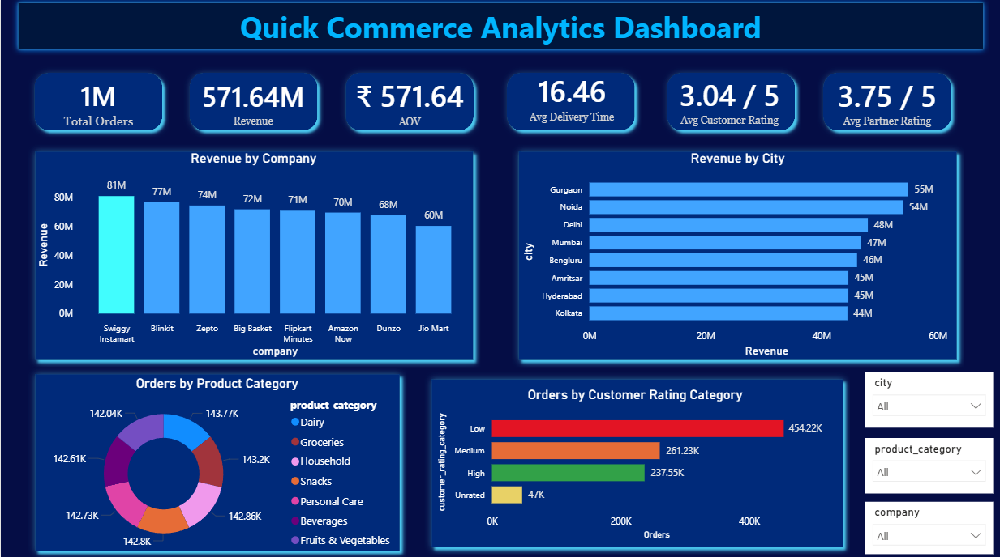
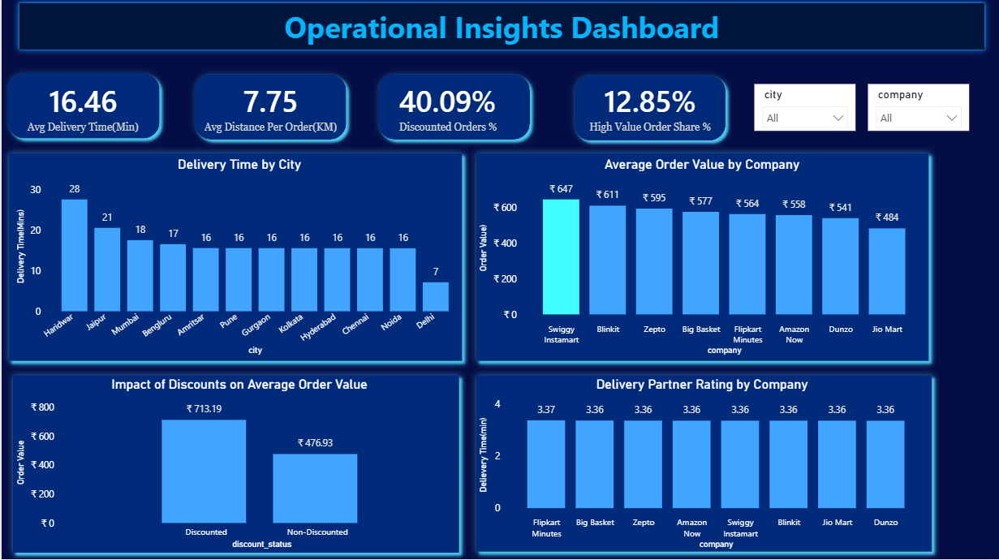

# Quick Commerce Analytics Dashboard

## Project Overview

This project analyzes **1 million quick-commerce orders** from leading platforms including Blinkit, Zepto, Swiggy Instamart, Dunzo, Big Basket, Amazon Now, Flipkart Minutes, and Jio Mart.

The objective is to uncover customer behavior, revenue trends, operational performance, delivery efficiency, and business insights using **Python, SQL, Power BI, and DAX**.

---

## Dataset Information

The dataset contains **1,000,000 quick-commerce orders** with customer, order, delivery, and product-related information.

### Dataset Features

- Order ID
- Company
- City
- Customer Age
- Product Category
- Order Value
- Items Count
- Payment Method
- Delivery Distance (KM)
- Delivery Time (Minutes)
- Customer Rating
- Delivery Partner Rating
- Discount Applied

### Engineered Features

- Age Group
- Customer Rating Category
- Delivery Speed Category
- Discount Status
- High Value Order Flag
- Distance Category

The dataset was cleaned, transformed, and enriched through feature engineering to support business analysis and dashboard development.

---

## Tools & Technologies

- Python (Pandas, NumPy, Matplotlib, Seaborn)
- SQL
- Power BI
- DAX

---

## Project Workflow

### 1. Data Cleaning & Preparation

- Handled missing values and duplicate records
- Standardized data formats
- Performed data validation checks

### 2. Feature Engineering

Created business-focused features:

- Age Group
- Customer Rating Category
- Delivery Speed Category
- Discount Status
- High Value Orders
- Distance Category

### 3. Exploratory Data Analysis (EDA)

Analyzed:

- Revenue Trends
- Customer Ratings
- Product Category Performance
- Delivery Performance
- Discount Impact
- Company-wise Performance
- City-wise Revenue Trends

### 4. Dashboard Development

Built a **2-page interactive Power BI dashboard** using KPI cards, DAX measures, slicers, and business-focused visualizations.

---

# Dashboard Screenshots

## Business Overview Dashboard



### KPIs

- Total Orders
- Revenue
- Average Order Value (AOV)
- Average Delivery Time
- Average Customer Rating
- Average Partner Rating

### Visualizations

- Revenue by Company
- Revenue by City
- Orders by Product Category
- Orders by Customer Rating Category

---

## Operational Insights Dashboard



### KPIs

- Average Delivery Time
- Average Distance per Order
- Discounted Orders Percentage
- High Value Order Percentage

### Visualizations

- Delivery Time by City
- Average Order Value by Company
- Impact of Discounts on Average Order Value
- Delivery Partner Rating by Company

---

## Key Business Insights

- Swiggy Instamart generated the highest revenue among all companies.
- Gurgaon recorded the highest revenue among analyzed cities.
- Discounted orders showed significantly higher average order values than non-discounted orders.
- Average delivery time remained close to 16 minutes across most cities.
- Customer and delivery partner ratings remained relatively consistent across companies.
- Product category contributions were fairly balanced across categories.
- High-value orders accounted for approximately 13% of total orders.

---

## Repository Structure

```text
Quick-Commerce-Analytics-Dashboard
│
├── Dashboard_Screenshots
│   ├── business_overview.png
│   └── operational_insights.png
│
├── SQL
│   └── quick_commerce_analysis.sql
│
├── Python
│   └── quick_commerce_analysis.ipynb
│
├── PowerBI
│   └── Quick_Commerce_Dashboard.pbix
│
└── README.md
```

---

## Skills Demonstrated

- Data Cleaning
- Exploratory Data Analysis
- Feature Engineering
- SQL Querying
- DAX Measures
- Data Visualization
- Dashboard Design
- Business Intelligence
- Business Insight Generation
- KPI Development

---

## Project Outcome

Developed an end-to-end analytics solution that transformed **1 million quick-commerce order records** into actionable business insights through Python, SQL, Power BI, and DAX. The project highlights customer behavior, revenue drivers, delivery efficiency, discount effectiveness, and operational performance through interactive dashboards and KPI-driven reporting.

---

## Author

**Sahithi Vittal**

- LinkedIn: linkedin.com/in/vittal-sahithi
- GitHub: github.com/SahithiVittal
